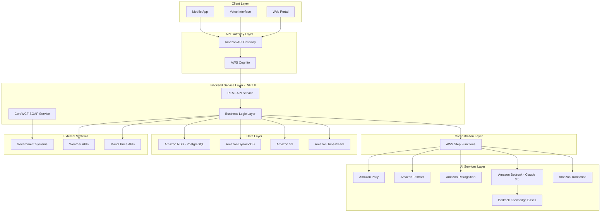

# Design Document: Kisan Mitra AI

## Overview

Kisan Mitra AI is a serverless, event-driven agricultural platform built on AWS that integrates voice, vision, and document processing capabilities to support farmers throughout the agricultural lifecycle. The platform uses a microservices architecture orchestrated by AWS Step Functions, with .NET 8 backend services providing enterprise-grade stability and CoreWCF for government system integration.

The system is designed around four core modules:
1. **Krishi-Vani**: Voice-first market intelligence using Amazon Transcribe and Bedrock
2. **Quality Grader**: Vision-based produce grading using Amazon Rekognition
3. **Dhara-Analyzer**: Soil health card digitization and regenerative planning using Amazon Textract
4. **Sowing Oracle**: Predictive planting recommendations combining weather and soil data

All modules share common infrastructure including Amazon Timestream for time-series data, Amazon Bedrock Knowledge Bases for RAG-based advisory, and a unified .NET 8 backend service layer.

## Architecture

### High-Level Architecture



### Architectural Principles

1. **Serverless-First**: Leverage AWS managed services to minimize operational overhead
2. **Event-Driven**: Use Step Functions for asynchronous workflow orchestration
3. **Microservices**: Each module operates independently with clear boundaries
4. **Polyglot Persistence**: Use appropriate data stores for different data types
5. **AI-Native**: Integrate AI services at the core of each module
6. **Offline-Capable**: Design for intermittent connectivity scenarios
7. **Enterprise Integration**: CoreWCF for SOAP-based government system integration

## Components and Interfaces

### 1. Krishi-Vani Module (Market Intelligence)

**Purpose**: Provide voice-first market intelligence with regional dialect support

**Components**:

- **VoiceQueryHandler**: Receives audio input and initiates Step Function workflow
- **TranscriptionService**: Wraps Amazon Transcribe with dialect-specific models
- **QueryParser**: Uses Bedrock to extract commodity, location, and intent from transcribed text
- **PriceRetriever**: Queries Timestream for current and historical Mandi prices
- **ResponseGenerator**: Uses Bedrock to generate natural language responses
- **VoiceSynthesizer**: Wraps Amazon Polly for dialect-specific voice synthesis

**Interfaces**:

```csharp
// .NET 8 Interface Definitions

public interface IVoiceQueryHandler
{
    Task<VoiceQueryResponse> ProcessVoiceQueryAsync(
        Stream audioStream, 
        string dialect, 
        string farmerId,
        CancellationToken cancellationToken);
}

public interface ITranscriptionService
{
    Task<TranscriptionResult> TranscribeAsync(
        Stream audioStream, 
        string languageCode,
        CancellationToken cancellationToken);
}

public interface IQueryParser
{
    Task<ParsedQuery> ParseQueryAsync(
        string transcribedText, 
        string context,
        CancellationToken cancellationToken);
}

public interface IPriceRetriever
{
    Task<IEnumerable<MandiPrice>> GetCurrentPricesAsync(
        string commodity, 
        string location,
        CancellationToken cancellationToken);
    
    Task<IEnumerable<MandiPrice>> GetHistoricalPricesAsync(
        string commodity, 
        string location, 
        DateTimeOffset startDate, 
        DateTimeOffset endDate,
        CancellationToken cancellationToken);
}

public interface IResponseGenerator
{
    Task<string> GenerateResponseAsync(
        ParsedQuery query, 
        IEnumerable<MandiPrice> prices,
        string dialect,
        CancellationToken cancellationToken);
}

public interface IVoiceSynthesizer
{
    Task<Stream> SynthesizeAsync(
        string text, 
        string voiceId, 
        string languageCode,
        CancellationToken cancellationToken);
}
```

**Step Function Workflow**:

```json
{
  "Comment": "Krishi-Vani Voice Query Processing",
  "StartAt": "TranscribeAudio",
  "States": {
    "TranscribeAudio": {
      "Type": "Task",
      "Resource": "arn:aws:states:::aws-sdk:transcribe:startTranscriptionJob",
      "Parameters": {
        "TranscriptionJobName.$": "$.jobName",
        "LanguageCode.$": "$.languageCode",
        "Media": {
          "MediaFileUri.$": "$.audioS3Uri"
        }
      },
      "Next": "WaitForTranscription",
      "Retry": [
        {
          "ErrorEquals": ["States.ALL"],
          "IntervalSeconds": 2,
          "MaxAttempts": 3,
          "BackoffRate": 2.0
        }
      ]
    },
    "WaitForTranscription": {
      "Type": "Wait",
      "Seconds": 3,
      "Next": "GetTranscriptionResult"
    },
    "GetTranscriptionResult": {
      "Type": "Task",
      "Resource": "arn:aws:states:::aws-sdk:transcribe:getTranscriptionJob",
      "Parameters": {
        "TranscriptionJobName.$": "$.jobName"
      },
      "Next": "ParseQuery"
    },
    "ParseQuery": {
      "Type": "Task",
      "Resource": "arn:aws:states:::bedrock:invokeModel",
      "Parameters": {
        "ModelId": "anthropic.claude-3-5-sonnet-20241022-v2:0",
        "Body": {
          "anthropic_version": "bedrock-2023-05-31",
          "max_tokens": 1000,
          "messages": [
            {
              "role": "user",
              "content.$": "States.Format('Extract commodity and location from: {}', $.transcription)"
            }
          ]
        }
      },
      "Next": "RetrievePrices"
    },
    "RetrievePrices": {
      "Type": "Task",
      "Resource": "arn:aws:states:::lambda:invoke",
      "Parameters": {
        "FunctionName": "PriceRetrieverFunction",
        "Payload.$": "$"
      },
      "Next": "GenerateResponse"
    },
    "GenerateResponse": {
      "Type": "Task",
      "Resource": "arn:aws:states:::bedrock:invokeModel",
      "Parameters": {
        "ModelId": "anthropic.claude-3-5-sonnet-20241022-v2:0",
        "Body": {
          "anthropic_version": "bedrock-2023-05-31",
          "max_tokens": 500,
          "messages": [
            {
              "role": "user",
              "content.$": "States.Format('Generate farmer-friendly response for prices: {}', $.prices)"
            }
          ]
        }
      },
      "Next": "SynthesizeVoice"
    },
    "SynthesizeVoice": {
      "Type": "Task",
      "Resource": "arn:aws:states:::aws-sdk:polly:synthesizeSpeech",
      "Parameters": {
        "Text.$": "$.response",
        "VoiceId.$": "$.voiceId",
        "OutputFormat": "mp3"
      },
      "End": true
    }
  }
}
```

### 2. Quality Grader Module (Vision)

**Purpose**: Grade produce quality from images and assign certified prices

**Components**:

- **ImageUploadHandler**: Receives and validates produce images
- **ImageAnalyzer**: Wraps Amazon Rekognition for defect detection and feature extraction
- **QualityClassifier**: Assigns grades based on size, color, and defect analysis
- **PriceCalculator**: Computes certified price using grade multipliers and current Mandi rates
- **GradingRecordStore**: Persists grading records with image references

**Interfaces**:

```csharp
public interface IImageUploadHandler
{
    Task<ImageUploadResult> UploadImageAsync(
        Stream imageStream, 
        string farmerId, 
        string produceType,
        CancellationToken cancellationToken);
}

public interface IImageAnalyzer
{
    Task<ImageAnalysisResult> AnalyzeImageAsync(
        string imageS3Key,
        CancellationToken cancellationToken);
}

public interface IQualityClassifier
{
    Task<QualityGrade> ClassifyQualityAsync(
        ImageAnalysisResult analysis, 
        string produceType,
        CancellationToken cancellationToken);
}

public interface IPriceCalculator
{
    Task<decimal> CalculateCertifiedPriceAsync(
        QualityGrade grade, 
        string commodity, 
        string location,
        CancellationToken cancellationToken);
}

public interface IGradingRecordStore
{
    Task<string> StoreGradingRecordAsync(
        GradingRecord record,
        CancellationToken cancellationToken);
    
    Task<IEnumerable<GradingRecord>> GetFarmerGradingHistoryAsync(
        string farmerId, 
        DateTimeOffset startDate, 
        DateTimeOffset endDate,
        CancellationToken cancellationToken);
}
```

**Data Models**:

```csharp
public record ImageAnalysisResult(
    float AverageSize,
    ColorProfile ColorProfile,
    IEnumerable<Defect> Defects,
    float ConfidenceScore);

public record ColorProfile(
    string DominantColor,
    float ColorUniformity,
    float Brightness);

public record Defect(
    string DefectType,
    float Severity,
    BoundingBox Location,
    float Confidence);

public enum QualityGrade
{
    A,      // Premium quality
    B,      // Good quality
    C,      // Acceptable quality
    Reject  // Below standard
}

public record GradingRecord(
    string RecordId,
    string FarmerId,
    string ProduceType,
    QualityGrade Grade,
    decimal CertifiedPrice,
    string ImageS3Key,
    DateTimeOffset Timestamp,
    ImageAnalysisResult Analysis);
```

### 3. Dhara-Analyzer Module (Soil & Carbon)

**Purpose**: Digitize Soil Health Cards and generate regenerative farming plans

**Components**:

- **DocumentUploadHandler**: Receives and validates Soil Health Card images
- **TextExtractor**: Wraps Amazon Textract for OCR and form extraction
- **SoilDataParser**: Parses and validates extracted soil nutrient data
- **RegenerativePlanGenerator**: Uses Bedrock with Knowledge Base to create 12-month plans
- **CarbonEstimator**: Calculates carbon sequestration potential

**Interfaces**:

```csharp
public interface IDocumentUploadHandler
{
    Task<DocumentUploadResult> UploadDocumentAsync(
        Stream documentStream, 
        string farmerId, 
        string documentType,
        CancellationToken cancellationToken);
}

public interface ITextExtractor
{
    Task<TextExtractionResult> ExtractTextAsync(
        string documentS3Key,
        CancellationToken cancellationToken);
}

public interface ISoilDataParser
{
    Task<SoilHealthData> ParseSoilDataAsync(
        TextExtractionResult extraction,
        CancellationToken cancellationToken);
    
    Task<ValidationResult> ValidateSoilDataAsync(
        SoilHealthData data,
        CancellationToken cancellationToken);
}

public interface IRegenerativePlanGenerator
{
    Task<RegenerativePlan> GeneratePlanAsync(
        SoilHealthData soilData, 
        FarmProfile farmProfile,
        CancellationToken cancellationToken);
}

public interface ICarbonEstimator
{
    Task<CarbonSequestrationEstimate> EstimateCarbonSequestrationAsync(
        RegenerativePlan plan, 
        SoilHealthData currentSoil,
        CancellationToken cancellationToken);
}
```

**Data Models**:

```csharp
public record SoilHealthData(
    string FarmerId,
    string Location,
    float Nitrogen,
    float Phosphorus,
    float Potassium,
    float pH,
    float OrganicCarbon,
    float Sulfur,
    float Zinc,
    float Boron,
    float Iron,
    float Manganese,
    float Copper,
    DateTimeOffset TestDate,
    string LabId);

public record RegenerativePlan(
    string PlanId,
    string FarmerId,
    IEnumerable<MonthlyAction> MonthlyActions,
    CarbonSequestrationEstimate CarbonEstimate,
    DateTimeOffset CreatedAt);

public record MonthlyAction(
    int Month,
    string MonthName,
    IEnumerable<string> Practices,
    string Rationale,
    IEnumerable<string> ExpectedOutcomes);

public record CarbonSequestrationEstimate(
    float TotalCarbonTonnesPerYear,
    float MonthlyAverageTonnes,
    IEnumerable<MonthlyCarbon> MonthlyBreakdown);

public record MonthlyCarbon(
    int Month,
    float EstimatedTonnes,
    string PrimaryPractice);
```

### 4. Sowing Oracle Module (Predictive Planting)

**Purpose**: Recommend optimal planting dates and seed varieties

**Components**:

- **WeatherDataCollector**: Fetches hyper-local weather forecasts
- **SoilDataRetriever**: Retrieves farmer's soil data from Timestream
- **PlantingWindowAnalyzer**: Uses Bedrock to identify optimal planting windows
- **SeedVarietyRecommender**: Recommends varieties based on soil and climate
- **ConfidenceScorer**: Calculates confidence scores for recommendations

**Interfaces**:

```csharp
public interface IWeatherDataCollector
{
    Task<WeatherForecast> GetForecastAsync(
        string location, 
        int daysAhead,
        CancellationToken cancellationToken);
}

public interface ISoilDataRetriever
{
    Task<SoilHealthData> GetLatestSoilDataAsync(
        string farmerId,
        CancellationToken cancellationToken);
}

public interface IPlantingWindowAnalyzer
{
    Task<IEnumerable<PlantingWindow>> AnalyzePlantingWindowsAsync(
        WeatherForecast forecast, 
        SoilHealthData soilData, 
        string cropType,
        CancellationToken cancellationToken);
}

public interface ISeedVarietyRecommender
{
    Task<IEnumerable<SeedRecommendation>> RecommendVarietiesAsync(
        PlantingWindow window, 
        SoilHealthData soilData, 
        string cropType,
        CancellationToken cancellationToken);
}

public interface IConfidenceScorer
{
    Task<float> CalculateConfidenceAsync(
        PlantingWindow window, 
        WeatherForecast forecast,
        CancellationToken cancellationToken);
}
```

**Data Models**:

```csharp
public record WeatherForecast(
    string Location,
    IEnumerable<DailyForecast> DailyForecasts,
    DateTimeOffset FetchedAt);

public record DailyForecast(
    DateOnly Date,
    float MinTemperature,
    float MaxTemperature,
    float Rainfall,
    float Humidity,
    float SoilMoisture);

public record PlantingWindow(
    DateOnly StartDate,
    DateOnly EndDate,
    string Rationale,
    float ConfidenceScore,
    IEnumerable<string> RiskFactors);

public record SeedRecommendation(
    string VarietyName,
    string SeedCompany,
    int MaturityDays,
    string SuitabilityReason,
    float YieldPotential,
    IEnumerable<string> KeyCharacteristics);
```

### 5. Backend Service Layer (.NET 8)

**Purpose**: Provide unified API layer and business logic orchestration

**Components**:

- **RESTful API Service**: ASP.NET Core Web API for mobile and web clients
- **SOAP Service**: CoreWCF service for government system integration
- **Authentication Service**: AWS Cognito integration
- **Authorization Service**: Role-based access control
- **Rate Limiting Service**: Request throttling and quota management
- **Logging Service**: Structured logging with AWS CloudWatch
- **Caching Service**: Redis-based caching for frequently accessed data

**API Endpoints**:

```csharp
// REST API Controllers

[ApiController]
[Route("api/v1/[controller]")]
public class VoiceQueryController : ControllerBase
{
    [HttpPost("query")]
    [Authorize]
    public async Task<ActionResult<VoiceQueryResponse>> ProcessVoiceQuery(
        [FromForm] IFormFile audioFile,
        [FromForm] string dialect,
        CancellationToken cancellationToken)
    {
        // Implementation
    }
}

[ApiController]
[Route("api/v1/[controller]")]
public class QualityGradingController : ControllerBase
{
    [HttpPost("grade")]
    [Authorize]
    public async Task<ActionResult<GradingResult>> GradeProduct(
        [FromForm] IFormFile image,
        [FromForm] string produceType,
        CancellationToken cancellationToken)
    {
        // Implementation
    }
    
    [HttpGet("history")]
    [Authorize]
    public async Task<ActionResult<IEnumerable<GradingRecord>>> GetGradingHistory(
        [FromQuery] DateTimeOffset startDate,
        [FromQuery] DateTimeOffset endDate,
        CancellationToken cancellationToken)
    {
        // Implementation
    }
}

[ApiController]
[Route("api/v1/[controller]")]
public class SoilAnalysisController : ControllerBase
{
    [HttpPost("upload-card")]
    [Authorize]
    public async Task<ActionResult<SoilHealthData>> UploadSoilHealthCard(
        [FromForm] IFormFile cardImage,
        CancellationToken cancellationToken)
    {
        // Implementation
    }
    
    [HttpPost("generate-plan")]
    [Authorize]
    public async Task<ActionResult<RegenerativePlan>> GenerateRegenerativePlan(
        [FromBody] PlanGenerationRequest request,
        CancellationToken cancellationToken)
    {
        // Implementation
    }
}

[ApiController]
[Route("api/v1/[controller]")]
public class PlantingAdvisoryController : ControllerBase
{
    [HttpPost("recommend")]
    [Authorize]
    public async Task<ActionResult<PlantingRecommendation>> GetPlantingRecommendation(
        [FromBody] PlantingRequest request,
        CancellationToken cancellationToken)
    {
        // Implementation
    }
}

[ApiController]
[Route("api/v1/[controller]")]
public class AdvisoryController : ControllerBase
{
    [HttpPost("ask")]
    [Authorize]
    public async Task<ActionResult<AdvisoryResponse>> AskQuestion(
        [FromBody] AdvisoryQuestion question,
        CancellationToken cancellationToken)
    {
        // Implementation
    }
}
```

**CoreWCF SOAP Service**:

```csharp
[ServiceContract]
public interface IGovernmentIntegrationService
{
    [OperationContract]
    Task<SoilHealthCardResponse> SubmitSoilHealthCardAsync(
        SoilHealthCardRequest request);
    
    [OperationContract]
    Task<FarmerRegistrationResponse> RegisterFarmerAsync(
        FarmerRegistrationRequest request);
    
    [OperationContract]
    Task<SubsidyEligibilityResponse> CheckSubsidyEligibilityAsync(
        SubsidyEligibilityRequest request);
}
```

### 6. Data Storage Strategy

**Amazon Timestream** (Time-Series Data):
- Mandi prices with timestamps
- Weather data history
- Soil health measurements over time
- Quality grading trends
- Carbon sequestration tracking

**Amazon S3** (Object Storage):
- Audio files (voice queries)
- Produce images
- Soil Health Card scans
- Generated reports (PDF)
- Backup data

**Amazon DynamoDB** (NoSQL):
- User profiles and preferences
- Session data
- Offline queue for pending operations
- Real-time operational data

**Amazon RDS PostgreSQL** (Relational):
- Farmer registration data
- Farm profiles
- Regenerative plans
- Advisory conversation history
- Audit logs

**Data Retention Policies**:
- Soil data: 10 years (Timestream + RDS)
- Market prices: 5 years (Timestream)
- Quality grades: 2 years (Timestream + S3)
- Audio files: 30 days (S3 with lifecycle policy)
- Images: 90 days (S3 with lifecycle policy)
- Logs: 1 year (CloudWatch)

### 7. Knowledge Base Architecture

**Amazon Bedrock Knowledge Base Configuration**:

- **Data Sources**:
  - Agricultural best practices documents (10,000+ PDFs)
  - Government agricultural guidelines
  - Research papers on regenerative farming
  - Pest and disease management guides
  - Crop-specific cultivation manuals
  - Regional farming calendars

- **Vector Store**: Amazon OpenSearch Serverless

- **Embedding Model**: Amazon Titan Embeddings

- **Retrieval Strategy**: Hybrid search (semantic + keyword)

- **RAG Implementation**:

```csharp
public interface IKnowledgeBaseService
{
    Task<KnowledgeBaseResponse> QueryKnowledgeBaseAsync(
        string query, 
        string context,
        int maxResults,
        CancellationToken cancellationToken);
}

public record KnowledgeBaseResponse(
    string Answer,
    IEnumerable<Citation> Citations,
    float ConfidenceScore);

public record Citation(
    string DocumentTitle,
    string DocumentUri,
    string RelevantExcerpt,
    float RelevanceScore);
```

## Data Models

### Core Domain Models

```csharp
// Farmer and Farm Models

public record FarmerProfile(
    string FarmerId,
    string Name,
    string PhoneNumber,
    string PreferredLanguage,
    string PreferredDialect,
    string Location,
    IEnumerable<FarmProfile> Farms,
    DateTimeOffset RegisteredAt);

public record FarmProfile(
    string FarmId,
    string FarmerId,
    float AreaInAcres,
    string SoilType,
    string IrrigationType,
    IEnumerable<string> CurrentCrops,
    GeoCoordinates Coordinates);

public record GeoCoordinates(
    double Latitude,
    double Longitude);

// Market Intelligence Models

public record MandiPrice(
    string Commodity,
    string Location,
    string MandiName,
    decimal MinPrice,
    decimal MaxPrice,
    decimal ModalPrice,
    DateTimeOffset PriceDate,
    string Unit);

public record VoiceQueryResponse(
    string ResponseText,
    string AudioS3Uri,
    IEnumerable<MandiPrice> Prices,
    DateTimeOffset ProcessedAt);

// Advisory Models

public record AdvisoryQuestion(
    string QuestionText,
    string FarmerId,
    string Context,
    IEnumerable<string> ConversationHistory);

public record AdvisoryResponse(
    string AnswerText,
    IEnumerable<Citation> Sources,
    bool RequiresExpertEscalation,
    DateTimeOffset RespondedAt);
```


## Correctness Properties

*A property is a characteristic or behavior that should hold true across all valid executions of a system—essentially, a formal statement about what the system should do. Properties serve as the bridge between human-readable specifications and machine-verifiable correctness guarantees.*

### Property Reflection

After analyzing all acceptance criteria, I've identified the following testable properties. Some properties have been consolidated to eliminate redundancy:

- Properties 1.2 and 8.1 both test query parsing/knowledge base querying - these are distinct enough to keep separate
- Properties 2.7 and 3.4 both test data persistence - consolidated into a general persistence property
- Properties 11.1 and 11.2 both test offline behavior - kept separate as they test different aspects (caching vs queueing)
- Properties related to time constraints (performance) have been excluded as they test performance, not correctness
- Properties that are configuration/capability requirements are tested as examples rather than universal properties

### Voice-Based Market Intelligence Properties

**Property 1: Query parsing extracts commodity and location**

*For any* transcribed voice query containing a commodity and location, the LLM Service should correctly extract both the commodity name and location from the text.

**Validates: Requirements 1.2**

**Property 2: Price retrieval returns valid Mandi prices**

*For any* valid commodity and location pair, the Krishi-Vani module should retrieve current Mandi prices from the Time Series Store with valid price values (min, max, modal) and timestamps.

**Validates: Requirements 1.3**

**Property 3: Voice synthesis produces audio for any response**

*For any* response text and dialect combination, the voice synthesizer should produce valid audio output in the specified dialect.

**Validates: Requirements 1.4**

**Property 4: Offline queries are queued and processed**

*For any* voice query submitted when network connectivity is unavailable, the system should queue the query and process it when connectivity is restored, producing the same result as if processed immediately.

**Validates: Requirements 1.5, 11.2**

**Property 5: Ambiguous queries trigger clarification**

*For any* voice query containing ambiguous commodity names (e.g., "rice" without specifying variety), the LLM Service should request clarification rather than making assumptions.

**Validates: Requirements 1.6**

### Produce Quality Grading Properties

**Property 6: Image analysis extracts required features**

*For any* valid produce image, the Vision Service should extract size measurements, color profile, and defect information from the image.

**Validates: Requirements 2.1**

**Property 7: Quality grading assigns valid grades**

*For any* image analysis result, the Quality Grader should assign exactly one grade from the set {A, B, C, Reject} based on the analysis data.

**Validates: Requirements 2.2**

**Property 8: Certified price calculation is consistent**

*For any* quality grade and Mandi rate, the certified price should be calculated as: certified_price = modal_mandi_price × grade_multiplier, where grade_multipliers are consistent (e.g., A=1.2, B=1.0, C=0.8, Reject=0).

**Validates: Requirements 2.3**

**Property 9: Batch grading aggregates individual grades**

*For any* collection of images from the same batch, the batch-level grade should be derived from the individual grades using a consistent aggregation function (e.g., weighted average or mode).

**Validates: Requirements 2.4**

**Property 10: Poor quality images are rejected**

*For any* image with blur score above threshold or brightness below threshold, the Quality Grader should reject the image and request a retake rather than producing a grade.

**Validates: Requirements 2.5**

**Property 11: Grading records are persisted**

*For any* completed grading operation, a record containing the grade, certified price, timestamp, and image reference should be stored and retrievable for at least 90 days.

**Validates: Requirements 2.7, 7.1**

### Soil Health Card Digitization Properties

**Property 12: Text extraction captures all fields**

*For any* valid Soil Health Card image, the Document Service should extract all required fields (N, P, K, pH, organic carbon, farmer ID, location, test date).

**Validates: Requirements 3.1**

**Property 13: Soil data parsing validates nutrient values**

*For any* extracted text from a Soil Health Card, the parser should validate that nutrient values fall within acceptable ranges (e.g., pH between 0-14, percentages between 0-100) and flag out-of-range values.

**Validates: Requirements 3.2**

**Property 14: Invalid extractions are flagged**

*For any* extraction result with missing or invalid fields, the Dhara Analyzer should identify the specific problematic fields and request manual verification rather than proceeding with invalid data.

**Validates: Requirements 3.3**

**Property 15: Digitized soil data is persisted with metadata**

*For any* validated soil health data, a record should be stored in the Time Series Store with farmer ID, location, timestamp, and all nutrient values.

**Validates: Requirements 3.4, 7.1**

**Property 16: Digitization completion triggers notification**

*For any* completed soil card digitization, a notification (voice or SMS) should be sent to the farmer.

**Validates: Requirements 3.6**

### Regenerative Farming Plan Properties

**Property 17: Plans are generated from soil data**

*For any* valid soil health data, the Dhara Analyzer should generate a 12-month regenerative plan containing monthly action items.

**Validates: Requirements 4.1**

**Property 18: Plan generation queries knowledge base**

*For any* plan generation request, the LLM Service should query the Knowledge Base for relevant regenerative farming practices (crop rotation, cover cropping, composting).

**Validates: Requirements 4.2**

**Property 19: Plans contain required components**

*For any* generated regenerative plan, it should include: (1) 12 monthly action items, (2) specific practices for each month, (3) carbon sequestration estimates, and (4) rationale for recommendations.

**Validates: Requirements 4.3**

**Property 20: Low organic carbon prioritizes carbon-building**

*For any* soil data with organic carbon below 0.5%, the generated plan should prioritize carbon-building practices (e.g., composting, cover crops) in the first 6 months.

**Validates: Requirements 4.4**

**Property 21: Plans are customized to farm characteristics**

*For any* two farms with different characteristics (size, crop, climate), the generated plans should differ in their recommended practices.

**Validates: Requirements 4.5**

**Property 22: Plans are delivered in multiple formats**

*For any* generated plan, both text and voice versions should be available in the farmer's preferred language.

**Validates: Requirements 4.6**

### Predictive Planting Properties

**Property 23: Weather data is retrieved for recommendations**

*For any* planting recommendation request, the Sowing Oracle should retrieve weather forecast data for the next 90 days for the farm's location.

**Validates: Requirements 5.1**

**Property 24: Recommendations combine weather and soil data**

*For any* planting recommendation, both weather forecast data and soil health data should be used in the analysis.

**Validates: Requirements 5.2**

**Property 25: Planting windows are based on environmental criteria**

*For any* identified planting window, the rationale should reference temperature, rainfall, and soil moisture patterns from the forecast data.

**Validates: Requirements 5.3**

**Property 26: Seed varieties match conditions**

*For any* recommended seed variety, the recommendation should explain how the variety is suited to the soil nutrient levels and climate conditions.

**Validates: Requirements 5.4**

**Property 27: Recommendations include confidence scores**

*For any* planting window recommendation, a confidence score between 0 and 100 should be provided.

**Validates: Requirements 5.5**

**Property 28: High-risk weather triggers alternatives**

*For any* weather forecast indicating drought risk (rainfall below threshold) or flood risk (rainfall above threshold), the Sowing Oracle should suggest alternative crops or mitigation strategies.

**Validates: Requirements 5.6**

**Property 29: Recommendations update with new weather data**

*For any* planting recommendation, when weather forecast data changes significantly (e.g., rainfall prediction changes by >20%), the recommendation should be updated accordingly.

**Validates: Requirements 5.7**

### Workflow Orchestration Properties

**Property 30: Services are coordinated in correct sequence**

*For any* module invocation, the Workflow Orchestrator should call AWS services in the correct dependency order (e.g., transcribe before parse, parse before retrieve).

**Validates: Requirements 6.1**

**Property 31: Failed services are retried with backoff**

*For any* service failure, the Workflow Orchestrator should retry up to 3 times with exponential backoff (e.g., 1s, 2s, 4s delays).

**Validates: Requirements 6.2**

**Property 32: Permanent failures are logged and reported**

*For any* workflow where all retries fail, an error should be logged with full context and the farmer should receive a fallback response.

**Validates: Requirements 6.3**

**Property 33: Context is preserved across modules**

*For any* multi-module workflow (e.g., voice query followed by quality grading), authentication context and farmer ID should be maintained without requiring re-authentication.

**Validates: Requirements 6.4**

**Property 34: Workflow status is reported**

*For any* executing workflow, real-time status updates should be provided to the farmer at each major step.

**Validates: Requirements 6.6**

### Historical Data and Analytics Properties

**Property 35: Data points are stored with metadata**

*For any* generated data point (price, grade, soil measurement), it should be stored in the Time Series Store with timestamp and farmer ID.

**Validates: Requirements 7.1**

**Property 36: Historical data is retrievable**

*For any* time period request within the retention period, the Platform should retrieve all data points for that period.

**Validates: Requirements 7.2**

**Property 37: Multi-period comparisons are supported**

*For any* historical data request spanning multiple seasons or years, the Platform should support side-by-side comparison of the periods.

**Validates: Requirements 7.4**

**Property 38: Insights are generated from patterns**

*For any* farmer with at least 2 years of historical data, the LLM Service should generate insights identifying trends and patterns.

**Validates: Requirements 7.5**

**Property 39: Regional aggregation preserves privacy**

*For any* regional benchmark query, the aggregated data should not allow identification of individual farmer data (minimum 10 farmers in aggregation).

**Validates: Requirements 7.6**

### Knowledge Base and Advisory Properties

**Property 40: Questions trigger knowledge base queries**

*For any* agricultural question (voice or text), the LLM Service should query the Knowledge Base before generating a response.

**Validates: Requirements 8.1**

**Property 41: RAG uses retrieved context**

*For any* advisory response, the generated answer should incorporate information from the retrieved knowledge base documents.

**Validates: Requirements 8.2**

**Property 42: Responses include citations**

*For any* advisory response that uses knowledge base content, citations should be provided with document titles and relevant excerpts.

**Validates: Requirements 8.4**

**Property 43: Unanswerable questions are escalated**

*For any* question where the Knowledge Base retrieval confidence is below threshold, the question should be escalated to human experts.

**Validates: Requirements 8.5**

**Property 44: Conversation context is maintained**

*For any* conversation with up to 10 exchanges, follow-up questions should have access to the full conversation history for context.

**Validates: Requirements 8.6**

### Backend Service Properties

**Property 45: Rate limiting enforces quotas**

*For any* farmer making more than 100 requests in a 60-second window, subsequent requests should be rejected with a 429 status code until the window resets.

**Validates: Requirements 9.4**

**Property 46: Errors are logged and user-friendly**

*For any* error occurring in the backend service, detailed error information should be logged while the user receives a simplified, actionable error message.

**Validates: Requirements 9.5**

### Security and Privacy Properties

**Property 47: Personal data is encrypted at rest**

*For any* personal data stored in the system (name, phone, location), it should be encrypted using AES-256 before being written to storage.

**Validates: Requirements 10.1**

**Property 48: Access control enforces data isolation**

*For any* farmer, API requests should only return data belonging to that farmer, not data from other farmers.

**Validates: Requirements 10.3**

**Property 49: Uploads are scanned for malware**

*For any* uploaded file (image or document), it should be scanned for malware before being processed or stored.

**Validates: Requirements 10.4**

**Property 50: Data deletion is honored**

*For any* farmer data deletion request, all personal data should be removed from all storage systems (except legally required audit logs) within 30 days.

**Validates: Requirements 10.6**

### Offline Capability Properties

**Property 51: Offline mode caches recent prices**

*For any* farmer device, when network connectivity is unavailable, the last 7 days of Mandi prices should be accessible from local cache.

**Validates: Requirements 11.1**

**Property 52: Offline operations are queued**

*For any* operation (voice query, image upload, document upload) submitted while offline, it should be queued locally and automatically processed when connectivity returns.

**Validates: Requirements 11.2**

**Property 53: Sync occurs after reconnection**

*For any* queued operations, when connectivity is restored, all queued items should be synced to the server.

**Validates: Requirements 11.3**

**Property 54: Offline status is indicated**

*For any* time when network connectivity is unavailable, the Platform should display an offline indicator to the farmer.

**Validates: Requirements 11.4**

**Property 55: Connectivity requirements are communicated**

*For any* operation that requires network connectivity (e.g., real-time price query) attempted while offline, the Platform should display a message explaining the connectivity requirement.

**Validates: Requirements 11.5**

**Property 56: Offline storage is bounded**

*For any* farmer device, the total offline storage (cached prices, queued operations, images) should not exceed 50 MB.

**Validates: Requirements 11.6**

### Multi-Language and Accessibility Properties

**Property 57: Language preference is persisted**

*For any* farmer who selects a language preference, that preference should be stored and applied to all subsequent sessions until changed.

**Validates: Requirements 12.3**

**Property 58: Interface mode switching is supported**

*For any* farmer using the platform, they should be able to switch between voice and text interfaces at any point without losing context.

**Validates: Requirements 12.6**


## Error Handling

### Error Categories and Strategies

**1. Transient Errors (Retry with Backoff)**
- AWS service throttling (503, 429 responses)
- Network timeouts
- Temporary service unavailability
- Strategy: Exponential backoff with jitter, max 3 retries

**2. Client Errors (Immediate Failure with Guidance)**
- Invalid image format or size
- Malformed audio files
- Missing required parameters
- Unsupported language/dialect
- Strategy: Return 400 Bad Request with specific guidance for correction

**3. Authentication/Authorization Errors**
- Invalid or expired tokens
- Insufficient permissions
- Strategy: Return 401/403 with re-authentication prompt

**4. Resource Not Found Errors**
- Farmer profile not found
- Historical data not available
- Strategy: Return 404 with suggestion to create/wait for data

**5. Service Degradation (Graceful Fallback)**
- AI service unavailable
- Knowledge Base unreachable
- Strategy: Use cached responses, simplified logic, or queue for later processing

**6. Data Quality Errors**
- OCR extraction confidence too low
- Image quality insufficient for grading
- Ambiguous voice query
- Strategy: Request user clarification or manual input

### Error Response Format

```csharp
public record ErrorResponse(
    string ErrorCode,
    string Message,
    string UserFriendlyMessage,
    IEnumerable<string> SuggestedActions,
    DateTimeOffset Timestamp,
    string RequestId);

// Example error codes
public static class ErrorCodes
{
    public const string IMAGE_TOO_BLURRY = "IMG_001";
    public const string AUDIO_FORMAT_INVALID = "AUD_001";
    public const string SOIL_CARD_UNREADABLE = "DOC_001";
    public const string RATE_LIMIT_EXCEEDED = "API_001";
    public const string SERVICE_UNAVAILABLE = "SYS_001";
    public const string AMBIGUOUS_QUERY = "NLP_001";
}
```

### Circuit Breaker Pattern

For external service calls (Mandi APIs, Weather APIs), implement circuit breaker:

```csharp
public interface ICircuitBreaker
{
    Task<T> ExecuteAsync<T>(
        Func<Task<T>> operation,
        CancellationToken cancellationToken);
}

// Configuration
public record CircuitBreakerConfig(
    int FailureThreshold = 5,
    TimeSpan OpenDuration = TimeSpan.FromMinutes(1),
    TimeSpan HalfOpenTimeout = TimeSpan.FromSeconds(30));
```

### Logging Strategy

**Structured Logging with AWS CloudWatch**:

```csharp
public interface IStructuredLogger
{
    void LogInformation(string message, object context);
    void LogWarning(string message, object context);
    void LogError(Exception exception, string message, object context);
}

// Log context includes:
// - FarmerId (for user-specific debugging)
// - RequestId (for tracing across services)
// - Module (Krishi-Vani, Quality-Grader, etc.)
// - Operation (transcribe, grade, parse, etc.)
// - Duration (for performance monitoring)
// - ErrorCode (for error categorization)
```

### Monitoring and Alerts

**CloudWatch Metrics**:
- API request count and latency (p50, p95, p99)
- Error rate by error code
- AI service invocation count and cost
- Step Function execution success/failure rate
- Queue depth for offline operations
- Storage usage (S3, Timestream, DynamoDB)

**Alerts**:
- Error rate > 5% for 5 minutes
- API latency p95 > 10 seconds
- Step Function failure rate > 10%
- Storage approaching quota limits
- Rate limit violations > 100/hour

## Testing Strategy

### Dual Testing Approach

The platform requires both unit testing and property-based testing for comprehensive coverage:

**Unit Tests**: Focus on specific examples, edge cases, and integration points
**Property Tests**: Verify universal properties across randomized inputs

Both approaches are complementary and necessary. Unit tests catch concrete bugs in specific scenarios, while property tests verify general correctness across a wide input space.

### Property-Based Testing Configuration

**Framework**: Use FsCheck for .NET 8 property-based testing

**Configuration**:
- Minimum 100 iterations per property test (due to randomization)
- Each property test must reference its design document property
- Tag format: **Feature: kisan-mitra-ai, Property {number}: {property_text}**

**Example Property Test**:

```csharp
using FsCheck;
using FsCheck.Xunit;

public class VoiceQueryProperties
{
    [Property(MaxTest = 100)]
    public Property QueryParsingExtractsCommodityAndLocation()
    {
        // Feature: kisan-mitra-ai, Property 1: Query parsing extracts commodity and location
        
        return Prop.ForAll(
            Arb.From<TranscribedQuery>(),
            query =>
            {
                // Arrange
                var parser = new QueryParser();
                
                // Act
                var result = parser.ParseQueryAsync(query.Text, query.Context).Result;
                
                // Assert
                return result.Commodity != null && result.Location != null;
            });
    }
}

// Custom generator for test data
public class TranscribedQueryGenerator
{
    public static Arbitrary<TranscribedQuery> Generate()
    {
        return Arb.From(
            from commodity in Gen.Elements("wheat", "rice", "tomato", "onion")
            from location in Gen.Elements("Delhi", "Mumbai", "Indore", "Bhopal")
            from template in Gen.Elements(
                $"What is the price of {{0}} in {{1}}?",
                "{{0}} ka bhav {{1}} mein kya hai?",
                "{{1}} mandi mein {{0}} ka rate batao")
            select new TranscribedQuery(
                string.Format(template, commodity, location),
                "market_price_query"));
    }
}
```

### Unit Testing Strategy

**Focus Areas for Unit Tests**:

1. **Edge Cases**:
   - Empty or null inputs
   - Boundary values (e.g., pH = 0, pH = 14)
   - Maximum size limits (50 MB offline storage)
   - Minimum data requirements (10 farmers for aggregation)

2. **Error Conditions**:
   - Malformed data
   - Service failures
   - Authentication failures
   - Rate limit violations

3. **Integration Points**:
   - AWS service mocking and integration
   - Database transactions
   - Step Function state transitions
   - External API interactions

4. **Specific Examples**:
   - Known Soil Health Card formats from specific states
   - Specific dialect phrases and their expected parsing
   - Known defect types and their grading impact

**Example Unit Test**:

```csharp
using Xunit;

public class QualityGraderTests
{
    [Fact]
    public async Task GradeProduct_WithBlurryImage_RejectsAndRequestsRetake()
    {
        // Arrange
        var grader = new QualityGrader();
        var blurryImage = TestData.GetBlurryImage();
        
        // Act
        var result = await grader.GradeProductAsync(blurryImage, "tomato");
        
        // Assert
        Assert.Equal(GradeStatus.Rejected, result.Status);
        Assert.Contains("retake", result.Message.ToLower());
        Assert.Contains("blur", result.Message.ToLower());
    }
    
    [Theory]
    [InlineData(QualityGrade.A, 1.2)]
    [InlineData(QualityGrade.B, 1.0)]
    [InlineData(QualityGrade.C, 0.8)]
    [InlineData(QualityGrade.Reject, 0.0)]
    public async Task CalculateCertifiedPrice_AppliesCorrectMultiplier(
        QualityGrade grade, 
        decimal expectedMultiplier)
    {
        // Arrange
        var calculator = new PriceCalculator();
        var mandiPrice = 100m;
        
        // Act
        var certifiedPrice = await calculator.CalculateCertifiedPriceAsync(
            grade, "tomato", "Delhi");
        
        // Assert
        Assert.Equal(mandiPrice * expectedMultiplier, certifiedPrice);
    }
}
```

### Integration Testing

**Step Function Testing**:
- Use AWS Step Functions Local for offline testing
- Test complete workflows end-to-end
- Verify state transitions and error handling
- Test retry logic and timeouts

**API Testing**:
- Use TestServer for in-memory API testing
- Test authentication and authorization flows
- Verify rate limiting behavior
- Test CORS and security headers

**Database Testing**:
- Use test containers for PostgreSQL and DynamoDB
- Test data retention policies
- Verify time-series queries in Timestream
- Test transaction rollback scenarios

### Performance Testing

**Load Testing**:
- Simulate 10,000 concurrent users
- Test API response times under load
- Verify auto-scaling behavior
- Test database connection pooling

**Stress Testing**:
- Test behavior at 2x expected load
- Identify breaking points
- Verify graceful degradation
- Test recovery after overload

**Tools**:
- Apache JMeter for load testing
- AWS CloudWatch for monitoring
- X-Ray for distributed tracing

### Security Testing

**Penetration Testing**:
- SQL injection attempts
- XSS and CSRF attacks
- Authentication bypass attempts
- Authorization escalation attempts

**Compliance Testing**:
- Data encryption verification
- Access control validation
- Audit log completeness
- Data deletion verification

### Test Data Management

**Synthetic Data Generation**:
- Generate realistic farmer profiles
- Create diverse produce images with known defects
- Generate Soil Health Cards in multiple state formats
- Create voice recordings in multiple dialects

**Test Data Privacy**:
- Never use real farmer data in tests
- Anonymize any production data used for testing
- Use synthetic PII (names, phone numbers, locations)

### Continuous Integration

**CI/CD Pipeline**:
1. Code commit triggers build
2. Run unit tests (must pass 100%)
3. Run property tests (must pass 100%)
4. Run integration tests
5. Security scanning (SAST)
6. Deploy to staging
7. Run smoke tests
8. Manual approval for production
9. Deploy to production
10. Run health checks

**Test Coverage Goals**:
- Unit test coverage: >80%
- Property test coverage: All 58 properties
- Integration test coverage: All API endpoints
- E2E test coverage: All critical user journeys

